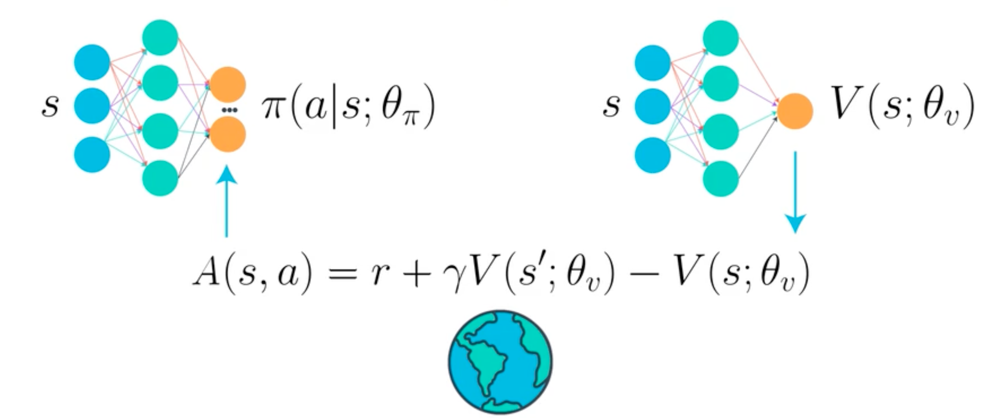
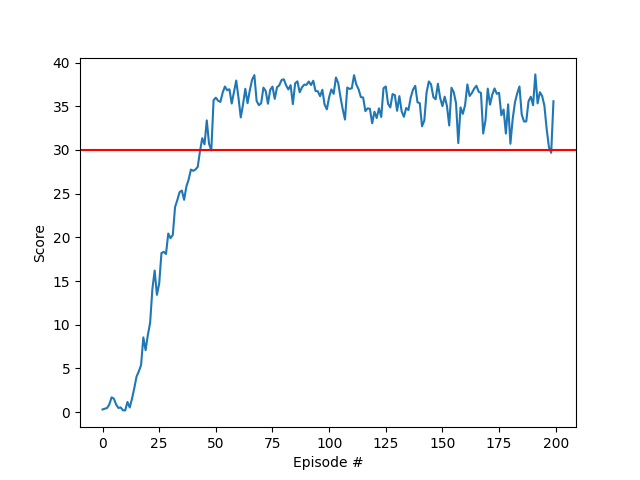

# Continuous Control Project - Reacher Environment

## Objective
The objective of this project is to develop an intelligent agent capable of controlling a double-jointed robotic arm within the Reacher environment, successfully reaching target locations with high precision. The environment features 20 simultaneous agents operating independently, which allows for efficient collection of experiences during training. To accomplish this, we employ the Deep Deterministic Policy Gradient (DDPG) algorithm, a state-of-the-art reinforcement learning technique suitable for continuous state and action spaces. Our implementation of the DDPG algorithm, combined with carefully chosen hyperparameters, allows the agent to learn efficiently and effectively. The environment is considered solved when the agent achieves an average score of 30 or more over 100 consecutive episodes. In our experiments, the agent was able to achive a score of +30 in about 50 episodes and maintain that score for more 150 episodes, demonstrating the effectiveness of the chosen algorithm and the training strategy.

    

# The Environment

## Environment Description

The Reacher environment is a Unity-based environment developed using the Unity ML-Agents toolkit. In this environment, the agent's goal is to control a double-jointed robotic arm to reach target locations. The agent receives a reward of +0.1 for each step that the arm's end effector is in the target location. The objective is to maintain the position of the end effector in the target location for as long as possible.

### State Space

The state space for the Reacher environment consists of 33 continuous variables that represent various information about the robotic arm, such as position, rotation, velocity, and angular velocities of the arm. The state space is thus continuous and has a dimensionality of 33.

### Action Space

The action space in the Reacher environment is continuous and consists of 4 variables corresponding to the torque applied to the two joints of the robotic arm. Each action variable is a real number between -1 and 1.

### Task Type

The task in the Reacher environment is considered episodic. Each episode consists of a fixed number of time steps, and the agent aims to maximize its total reward over these steps. The environment is considered solved when the agent achieves an average score of 30 or more over 100 consecutive episodes.

# The Algorithm

## Deep Deterministic Policy Gradient (DDPG)
In this project, we utilize the Deep Deterministic Policy Gradient (DDPG) algorithm, an actor-critic method specifically designed for continuous control tasks. The DDPG algorithm incorporates two neural networks: the Actor network, responsible for determining the optimal actions given the current state, and the Critic network, responsible for estimating the state-action value function (Q-function). Both networks have target networks that are used to stabilize the learning process by providing a fixed target during updates.

This technique combines the best of the two different approaches of policy-based and value-based methods. The Actor network is trained using the policy gradient method, which is a reinforcement learning technique that directly optimizes the policy function. The Critic network is trained using the Q-learning method, which is a technique that directly optimizes the Q-function. The DDPG algorithm combines these two methods by using the Critic network to estimate the Q-function, which is then used to train the Actor network. This hybrid approach allows the agent to learn effectively and efficiently in continuous control environments.
This here is how we define how the algorithm learns combining the two networks:

## Neural Networks Architecture
The architecture of both the Actor and Critic networks consists of two hidden layers, each containing 400 nodes. The activation function used for hidden layers is the ReLU (Rectified Linear Unit) activation function, while the output layer of the Actor network employs a tanh activation function to produce actions in the range of -1 to 1. The Critic network's output layer does not have an activation function, as it estimates the Q-function directly.

Several hyperparameters were carefully chosen to achieve efficient learning. We used a buffer size of 200,000 to store experiences for replay, a batch size of 256 for learning updates, an actor learning rate of 5e-4, a critic learning rate of 1e-3, a soft update parameter (tau) of 5e-3, and a discount factor (gamma) of 0.995. Furthermore, we incorporated action noise to facilitate exploration, with an initial noise scale of 0.5 and a noise decay rate of 0.998.

## Training

The training process 20 parallel agents have a continuous interaction between the Actor and Critic networks, allowing each agent to collect experiences in parallel. The agents share the same Actor and Critic networks, allowing them to learn collectively from the experiences gathered by all agents. This speeds up the learning process and allows the agents to learn more efficiently.

The steps to train the agent are as follows:

1. Initialize the networks: The agents begin by initializing both the shared Actor and Critic networks and their respective target networks with random weights. These target networks are used to provide a stable learning target during updates.

2. Interact with the environment: Each of the 20 agents, using the shared Actor network, interacts with the environment by choosing actions based on its current state. To encourage exploration, a noise term is added to the actions during the initial stages of training. After taking the action, each agent observes the resulting reward and the next state.

3. Store experiences: Each agent stores the observed experience (state, action, reward, next_state) in a shared replay buffer. This buffer holds a fixed number of recent experiences, allowing the agents to learn from a diverse set of transitions collected by all agents.

4. Learn from experiences: Periodically, a batch of experiences is sampled from the shared replay buffer. The shared Critic network is updated using the sampled experiences by minimizing the mean squared error between the predicted and target Q-values. The target Q-values are calculated using the shared Critic target network and the shared Actor target network.

5. Update the Actor network: The shared Actor network is updated using the policy gradient, which is computed by taking the gradient of the output of the shared Critic network with respect to the chosen actions. The shared Actor network learns to choose actions that maximize the expected Q-values.

6. Update target networks: The shared Actor and Critic target networks are softly updated using a mix of the current and target network weights. This ensures a stable learning process.

In summary, the DDPG algorithm, combined with the chosen hyperparameters and neural network architecture, enables the 20 agents to collectively learn and adapt their behavior effectively within the continuous control environment, ultimately achieving the desired performance in the Reacher task by sharing experiences and benefiting from each other's learning.

## Algorithm choice

The DDPG algorithm was chosen for this task due to its ability to handle continuous action spaces effectively, which is a critical aspect of the Reacher environment. By combining the strengths of policy gradient methods and deep Q-networks, DDPG can learn an optimal policy for the agent in a data-efficient and stable manner. Additionally, this algorithm is well-suited for the task as it can efficiently utilize the parallel experiences collected by multiple agents, allowing for faster learning and better convergence. The presence of 20 agents working simultaneously enables the sharing of experiences, leading to a richer training dataset and, ultimately, improved performance in the Reacher task.

# Results

During the training process, the agent's performance was monitored and evaluated based on its average score across all 20 agents. The agent showed steady improvement in its ability to solve the Reacher task, as evidenced by the increasing average scores over the course of training. Early on, the agent's performance was relatively low, but as it continued to explore the environment and gather experiences, its ability to predict the optimal actions for maximizing rewards improved significantly.

This plot shows the average score of the agents over the course of training, with the threshold score of 30 highlighted in red:

After about 50 episodes, the agent demonstrated a remarkable level of proficiency in the task, achieving an average score that surpassed the threshold required to consider the environment solved (30+) and maintained that level of performance for 150 episodes.

It is essential to note that the agent's performance varied throughout the training process, and occasional fluctuations were observed. However, the general trend showed an upward trajectory, indicating that the learning process was successful.

After reaching the desired performance, the learning plateaued, and did not surpass the score of 40, demonstrating that there is room to further improve the agent's performance. This is an area of future work that can be explored to further optimize the agent's performance.

# Ideas for Future Work

1. Hyperparameter tuning: In this project, the hyperparameters were chosen based on a combination of recommendations from literature and empirical testing. However, there is potential for further optimization through systematic hyperparameter tuning, which could lead to even better performance.

2. Parallel training with more agents: In this project, we used 20 agents to collect experiences simultaneously. Investigating the impact of using more agents on the overall learning process could potentially lead to faster convergence or improved performance.

3. Exploration strategies: The exploration strategy used in this project was based on adding noise to the agent's actions. Alternative methods, such as parameter space noise or intrinsic motivation, could be explored to determine their impact on the agent's learning process.
